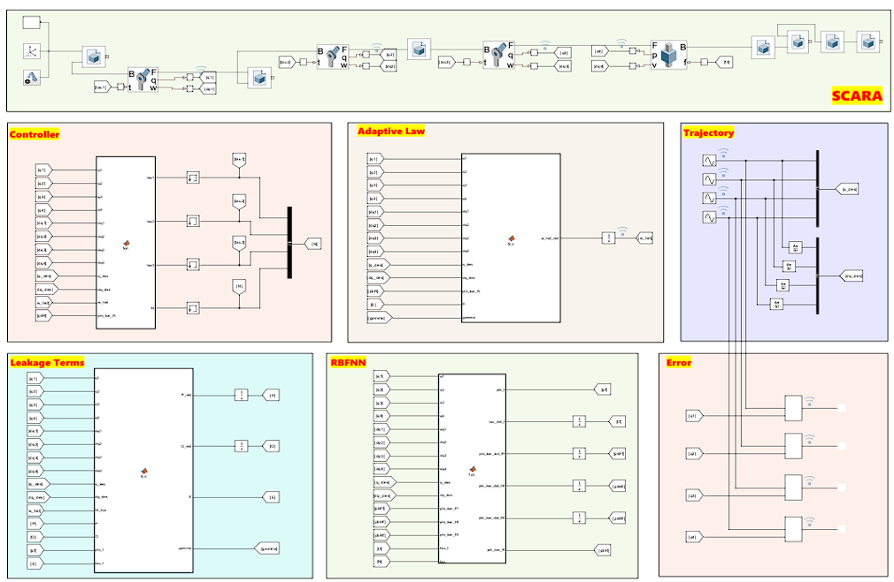
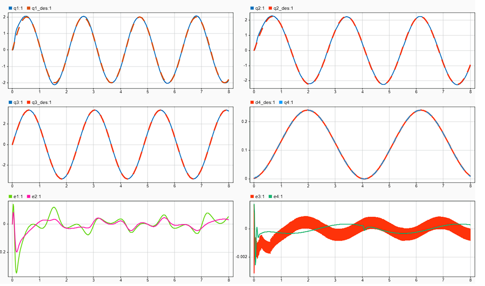

# 🤖4-DOF SCARA Robot - Adaptive Neural Network Control

This repository presents the complete modeling, simulation, and adaptive control of a 4-degree-of-freedom SCARA robot (three revolute joints and one prismatic joint) in MATLAB/Simulink Multibody Simulation.
The project integrates CAD-based mechanical modeling, dynamic simulation, and adaptive neural network (ANN) control to achieve precise end-effector motion under sensor noise and external disturbances.

# 💡Overview

The work starts with the CAD modeling of the robot’s links and joints. These parts are assembled in MATLAB’s Multibody Simulation environment to create a dynamic model capable of simulating realistic mechanical behavior.
An Adaptive Neural Network controller is implemented to compensate for nonlinearities and parameter uncertainties. The controller continuously adjusts its parameters online, providing robustness to sensor noise and external disturbances.

# ⚙️Repository Structure

/CAD/ — Contains all CAD files for each SCARA robot component used in the multibody assembly.

/Simulation/ — Includes all simulation models and control implementations:

Files ending with _2DOF → Dynamically modeled 2-DOF SCARA robots (based on analytical dynamic equations).

Files ending with _4DOF → Full multibody SCARA models simulated in MATLAB’s Simscape Multibody.

Files with suffix a_ → Base controller (standard adaptive neural control).

Files with suffix b_ → Controller with guaranteed convergence.

Files with suffix c_ → Controller with finite-time convergence guarantee.

Files containing noise → Models with white noise added to joint position sensors.

Files containing disturbance → Models including external disturbance forces applied to joints.

# 🧠Control Methodology

The Adaptive Neural Network Control scheme learns the system dynamics in real time and updates control signals accordingly.
The control objective is to ensure accurate trajectory tracking and robustness under uncertain system parameters and external perturbations.
Comparative performance between the base, convergence-guaranteed, and finite-time controllers is evaluated.

# 🧩SCARA Robot Overview

The SCARA (Selective Compliance Assembly Robot Arm) is a parallel-axis robot used widely in assembly operations, pick-and-place tasks, and precision automation.
Its planar movement capability, combined with high stiffness in the vertical direction, makes it ideal for industrial applications requiring high speed and repeatability.

# 🎯Features

-CAD-based 4-DOF SCARA robot modeling    
-MATLAB Multibody simulation with dynamic visualization    
-Adaptive Neural Network controller implementation       
-Robust control under noise and disturbance     
-Comparative study of three control strategies (a, b, c)   

# 📘Reference Paper

The controller design and methodology are based on the approach presented in the following paper:     
🔗 Adaptive neural network control for robotic manipulators with guaranteed finite-time convergence
✨Star if you find it useful

  
  
   

